# AwesomeGIC Bank

(Take-home assignment for an interview)

A modern, user-friendly and fully accessible banking application with **100% test coverage**, built with React and TypeScript.

🏦 **Live Demo**: [gicbank.hung.dev](https://gicbank.hung.dev)

- [AwesomeGIC Bank](#awesomegic-bank)
  - [Features](#features)
  - [Performance](#performance)
  - [Technologies Used](#technologies-used)
  - [Getting Started](#getting-started)
    - [Prerequisites](#prerequisites)
    - [Installation](#installation)
    - [Development](#development)
    - [Testing](#testing)
    - [Building for Production](#building-for-production)
    - [Deployment](#deployment)
  - [Project Structure](#project-structure)
  - [Screenshots](#screenshots)

## Features

- **Account Management**

  - View current balance
  - Make deposits
  - Make withdrawals with balance validation
  - View transaction history with timestamps
  - Print account statements
  - Persist data to local storage

- **User Experience**
  - Fully accessible
  - Clean and intuitive interface
  - Real-time balance updates
  - Transaction success notifications
  - Error handling with user-friendly messages
  - Responsive design for all devices

## Performance

100 points on Lighthouse and 99 points on Google PageSpeed Insights

|                             |                             |
| --------------------------- | --------------------------- |
| 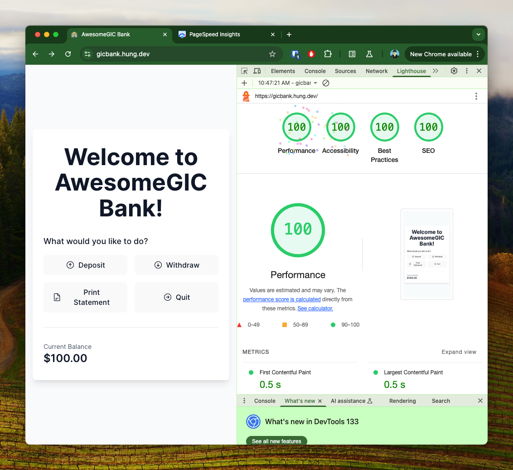 | 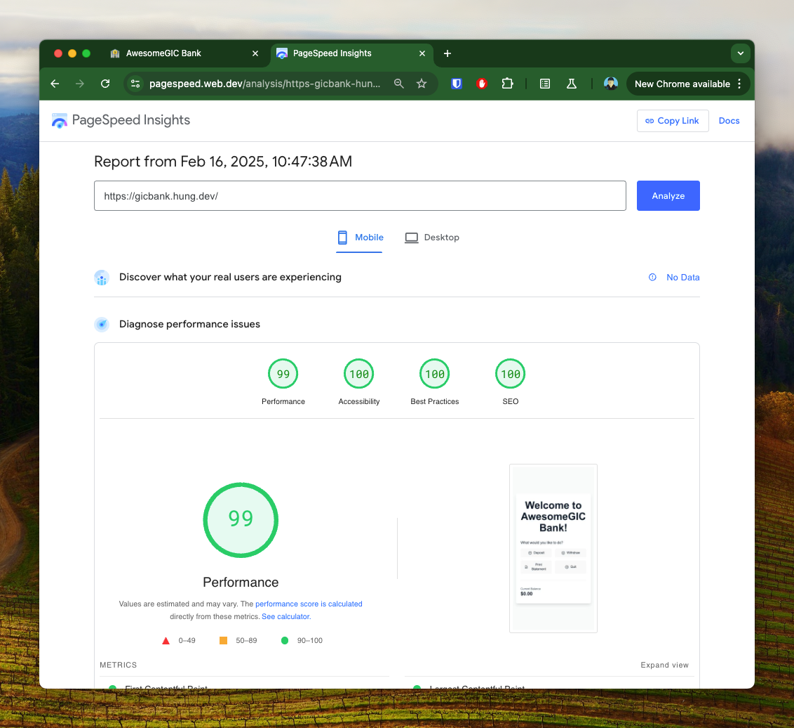 |

## Technologies Used

- **Frontend**

  - React 18
  - TypeScript
  - Tailwind CSS
  - Heroicons
  - date-fns

- **Testing**

  - Vitest
  - React Testing Library
  - @testing-library/user-event
  - @testing-library/jest-dom

- **Development Tools**
  - Vite
  - ESLint
  - Prettier
  - Git

## Getting Started

### Prerequisites

- Node.js (v18 or higher)
- npm or yarn or pnpm (pnpm is recommended)

### Installation

1. Clone the repository

   ```bash
   git clone https://github.com/nvh95/gicbank.git # Private repository
   cd awesome-gic-bank
   ```

2. Install dependencies
   ```bash
   npm install
   # or
   yarn
   # or
   pnpm
   ```

### Development

Run the development server:

```bash
npm run dev
# or
yarn dev
# or
pnpm dev
```

The application will be available, usually at `http://localhost:5173`

### Testing

|                                |                                |
| ------------------------------ | ------------------------------ |
| 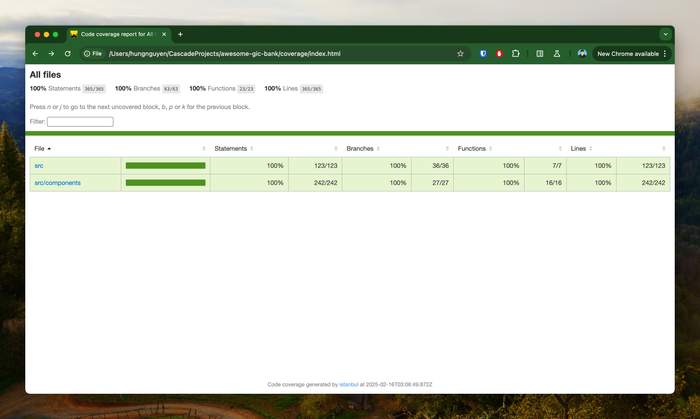 | 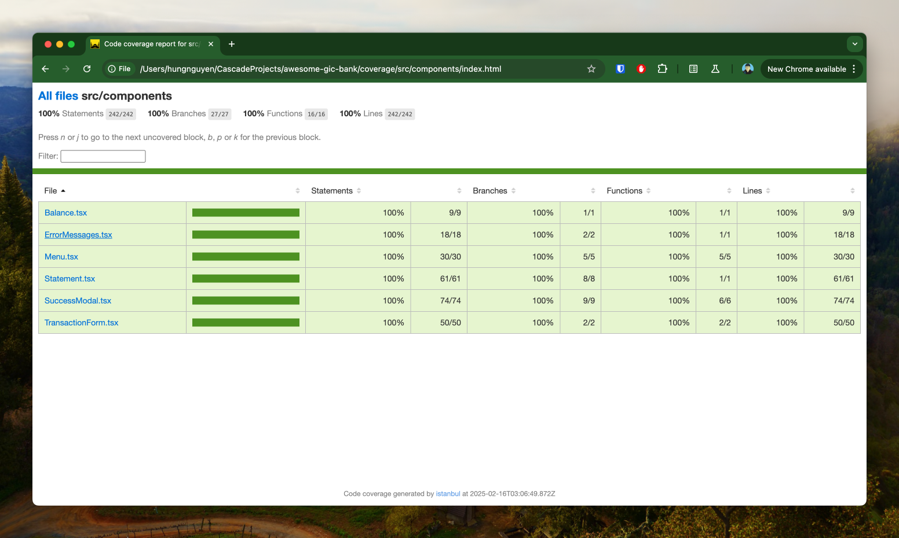 |

100% test coverage

Run the test suite:

```bash
npm run test
# or
yarn test
# or
pnpm test
```

View test coverage:

```bash
npm run test:coverage
# or
yarn test:coverage
# or
pnpm test:coverage
```

Then open [coverage/index.html](coverage/index.html) directly in your browser.

### Building for Production

Build the application:

```bash
npm run build
# or
yarn build
# or
pnpm build
```

Production build will be available at `dist/`.

Preview the production build:

```bash
npm run preview
# or
yarn preview
# or
pnpm preview
```

### Deployment

This project is deployed to Netlify. You can find the live demo at [gicbank.hung.dev](https://gicbank.hung.dev).

## Project Structure

```
awesome-gic-bank/
├── src/
│   ├── components/    # Reusable UI components
│   ├── tests/         # Test setup, configuration and test cases
│   ├── App.tsx        # Main application component
│   └── main.tsx       # Application entry point
├── public/            # Static assets
└── index.html         # HTML template
```

## Screenshots

- Home page
  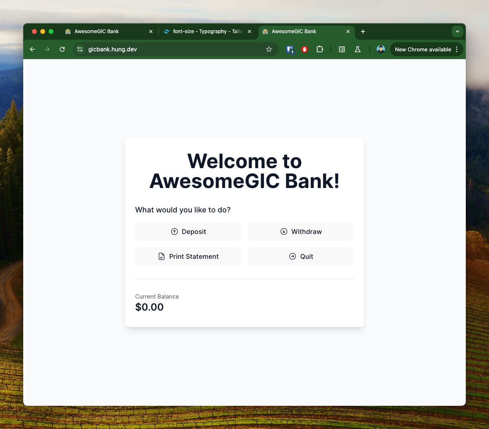

- Deposit
  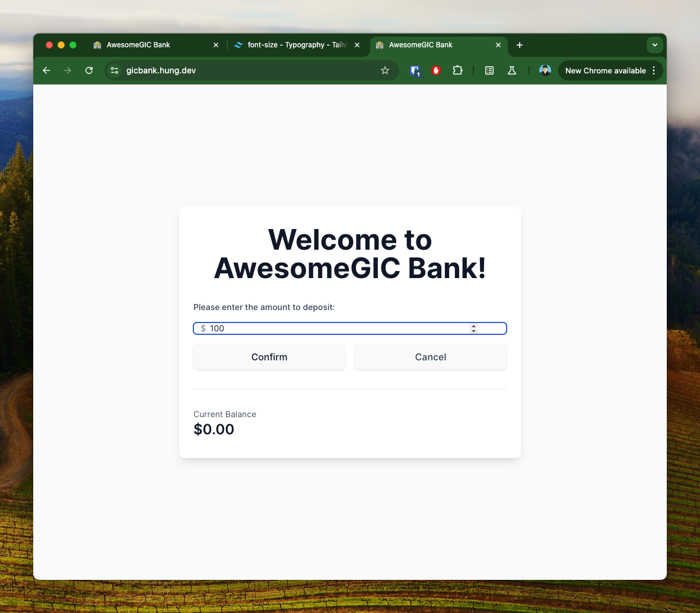

- Deposit successfully
  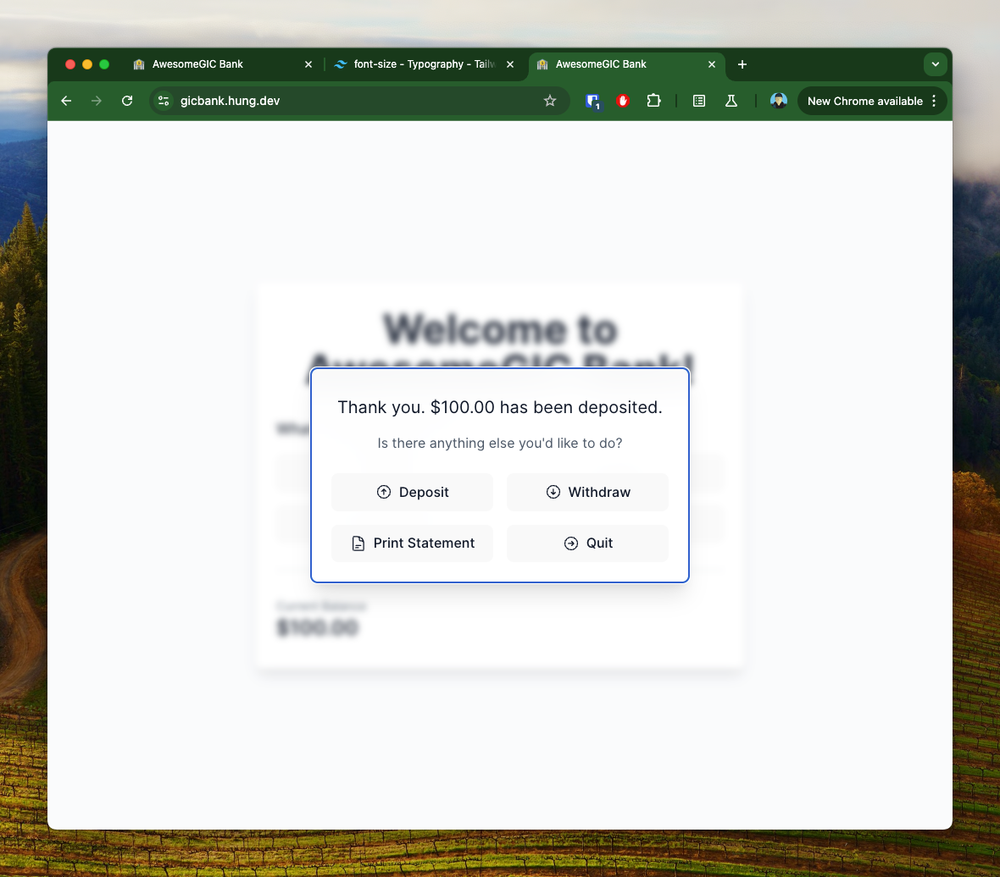

- Withdraw
  

- Withdraw successfully
  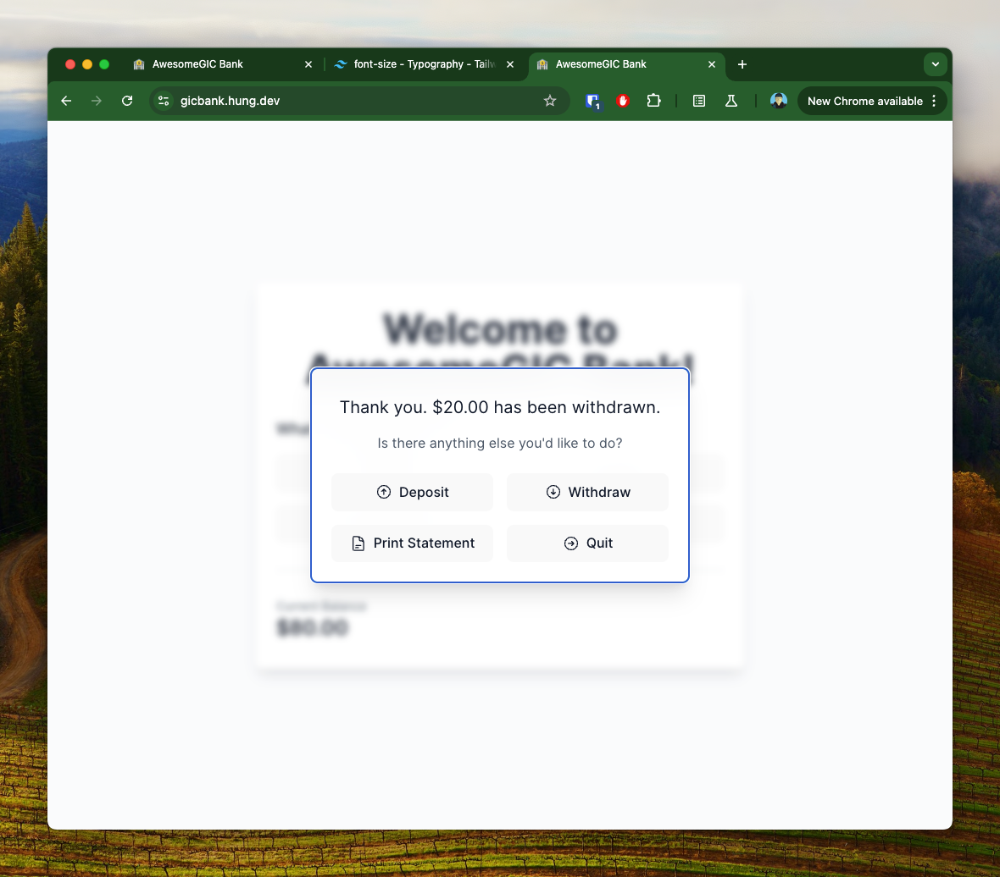

- Insufficient balance
  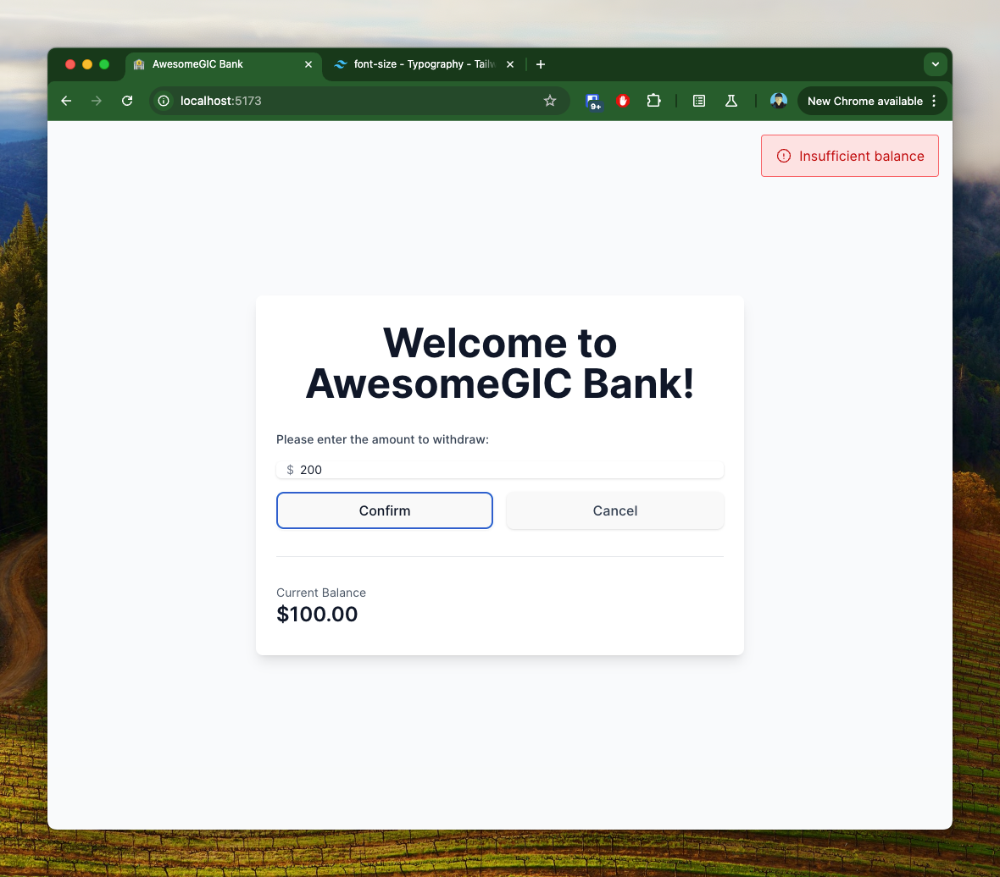

- Print Statement
  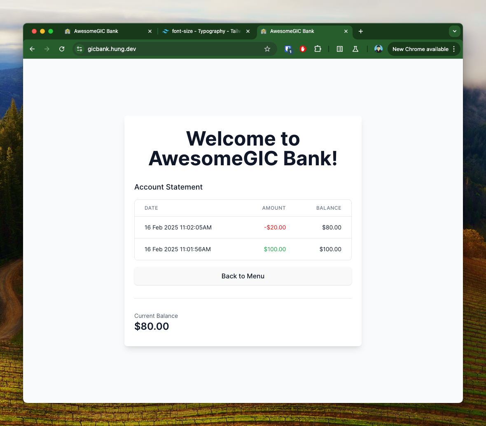

- Quit
  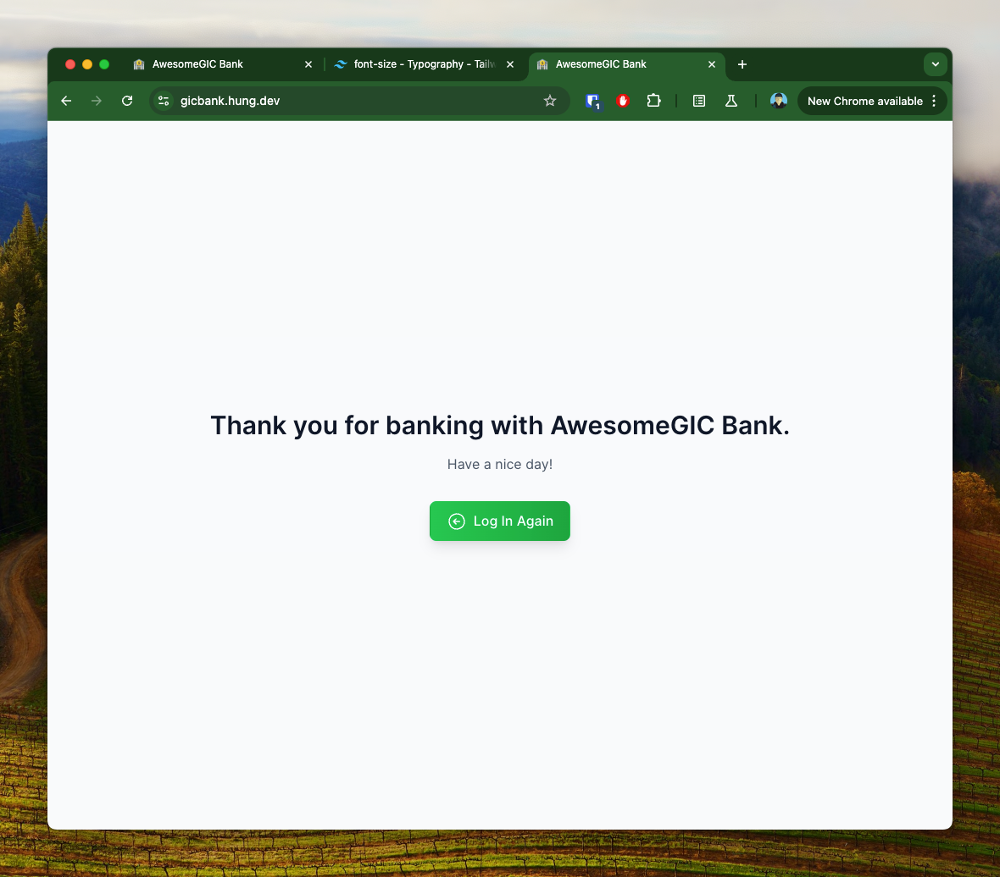
